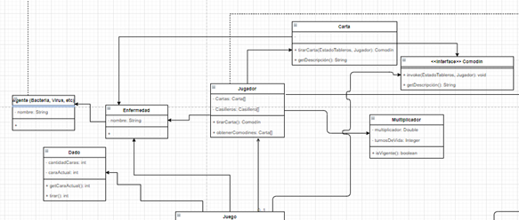
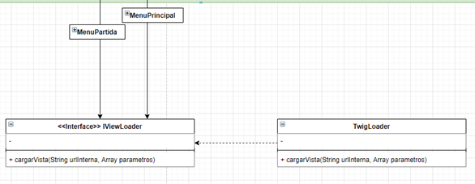
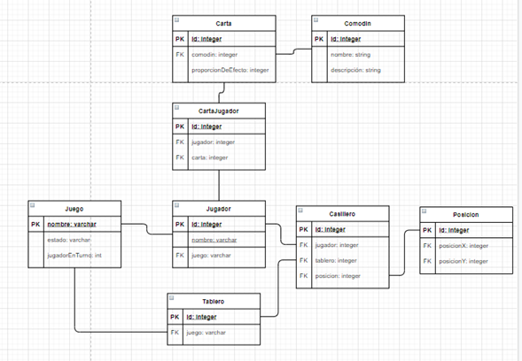

# Diagrama de clases

## Modelo

La primera clase que identificamos la llamamos Juego, identifica una partida determinada. Se aclara que, no agregamos ni los getters ni setters como métodos, para mejorar la legibilidad.
La decisión de hacer a las enfermedades accesibles desde el juego, es porque desconocemos la posibilidad de que en un futuro se quieran hacer nuevos niveles (extensiones de juego) que tengan restricciones en las enfermedades disponibles. Al igual que con los comodines.

Si bien lo hablado el día viernes 30/11 en una reunión a las 19 horas con el dueño de la idea y un profesor de la asignatura, fue que los tipos de enfermedades en un principio no van a impactar en el juego. Se dejaron las clases por si surge la funcionalidad en una siguiente iteración o nivel.
Para agregar funcionalidad se debe extender estas clases.
Hay una aclaración relevante. Los cambios que ocurran al utilizar un comodín son responsabilidad del mismo. Además, puede haber varios comodines que hagan lo mismo, pero en proporciones diferentes. Por lo que se separó a una carta de un comodín, para dividir cualquier problema que surja y que no hayamos previsto. Aunque podrían ser la misma clase. 

Hay reglas especiales para algunos casilleros.
Cuando un jugador tira un dado, puede ocupar una cantidad igual de casilleros a lo que saque. También hay un multiplicador, que puede influir en la cantidad de ocupaciones.
Luego, al ocupar ciertos casilleros se pueden activar efectos ocultos. De los cuales, sólo se hablaron sobre influir en el multiplicador del jugador o el casillero mismo. Sin embargo, si surge algo que modifique otro aspecto del juego, hay que modificar las firmas de la clase Casillero.

Interfaces
Las cuales implementan las clases Tablero, Jugador y Agente.

## Controlador

## Vista

# Modelo de datos

